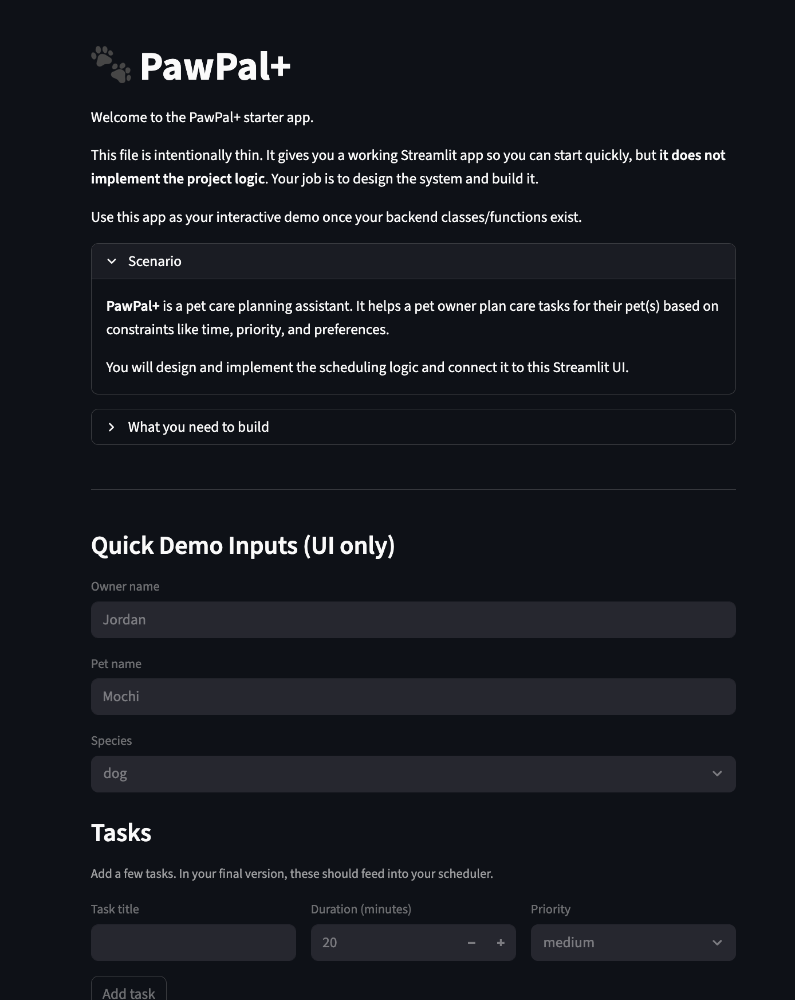
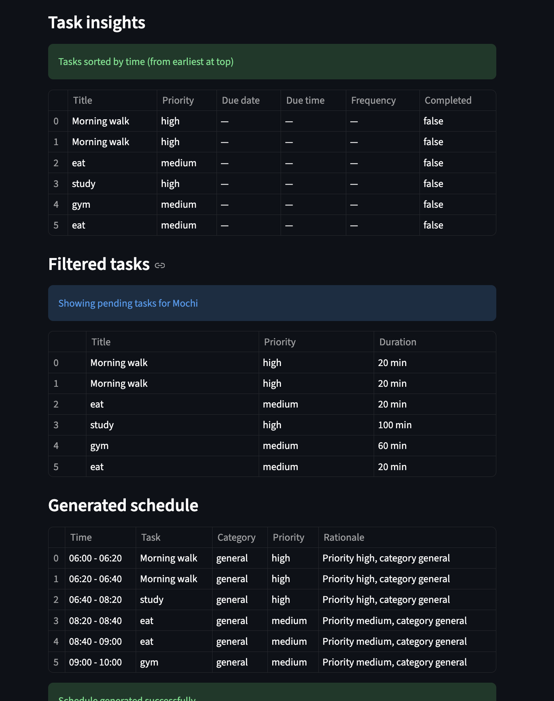

# PawPal+

> A smart pet care task manager built with Python and Streamlit.

## Scenario

A busy pet owner needs help staying consistent with pet care. They want an assistant that can:

- Track pet care tasks (walks, feeding, meds, enrichment, grooming, etc.)
- Consider constraints (time available, priority, owner preferences)
- Produce a daily plan and explain why it chose that plan

## What you will build

Your final app should:

- Let a user enter basic owner + pet info
- Let a user add/edit tasks (duration + priority at minimum)
- Generate a daily schedule/plan based on constraints and priorities
- Display the plan clearly (and ideally explain the reasoning)
- Include tests for the most important scheduling behaviors

## Getting Started

### Setup

```bash
python -m venv .venv
source .venv/bin/activate  # Windows: .venv\Scripts\activate
pip install -r requirements.txt
```

### Suggested Workflow

1. Read the scenario carefully and identify requirements and edge cases.
2. Draft a UML diagram (classes, attributes, methods, relationships).
3. Convert UML into Python class stubs (no logic yet).
4. Implement scheduling logic in small increments.
5. Add tests to verify key behaviors.
6. Connect your logic to the Streamlit UI in `app.py`.
7. Refine UML so it matches what you actually built.

## Features

PawPal+ supports:

- Owner/pet/task models with full task metadata (category, duration, due date/time, recurrence, priority)
- `Scheduler.generate_daily_plan` with window-aware scheduling (06:00–22:00 default)
- `Scheduler.sort_by_time` to display tasks by due time
- `Owner.filter_tasks` to query pending/completed tasks per pet
- Recurring task lifecycle: completing daily/weekly tasks auto-schedules the next occurrence
- Conflict detection:
  - `Scheduler.detect_conflicts` (due-time vs. available schedule urgency)
  - `Scheduler.detect_schedule_conflicts` (overlapping scheduled slots)
- Rich UI feedback via Streamlit (`st.success`, `st.warning`, `st.error`, `st.table`)

## Smarter Scheduling

This implementation includes improved logic in `pawpal_system.py`:

- Sort tasks by priority + due time, with an optional `Scheduler.sort_by_time` method for due-time-only ordering
- Filter tasks by `completed` status and `pet_name` via `Owner.filter_tasks`
- Recurring task handling (`daily`, `weekly`) managed through `Task.frequency` and `Pet.mark_task_complete`
- Conflict detection with `Scheduler.detect_conflicts` (due-time urgency) and `Scheduler.detect_schedule_conflicts` (overlapping schedule slots)
- Plan output includes explanations and a skipped-task report

## Testing PawPal+

Run the test suite:

```bash
python -m pytest
```

Tests cover:

- Task completion status changes via `mark_complete()`
- Pet task count increases when tasks are added
- Chronological sort correctness via `sort_by_time()`
- Recurring task recurrence (daily task auto-schedules next day on completion)
- Conflict detection flags tasks scheduled at duplicate times

**Confidence Level:** ⭐⭐⭐⭐⭐ (5/5)

## 📸 Demo

### Screenshots for evaluator





